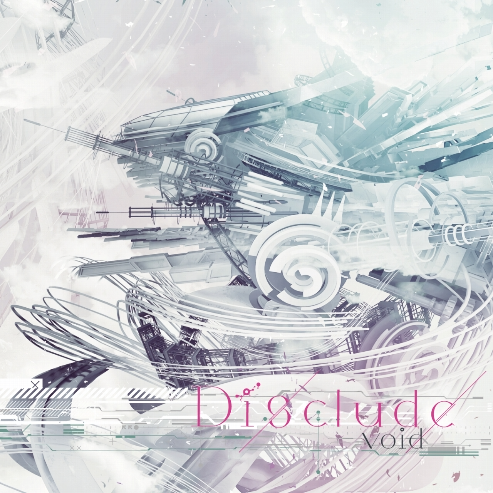
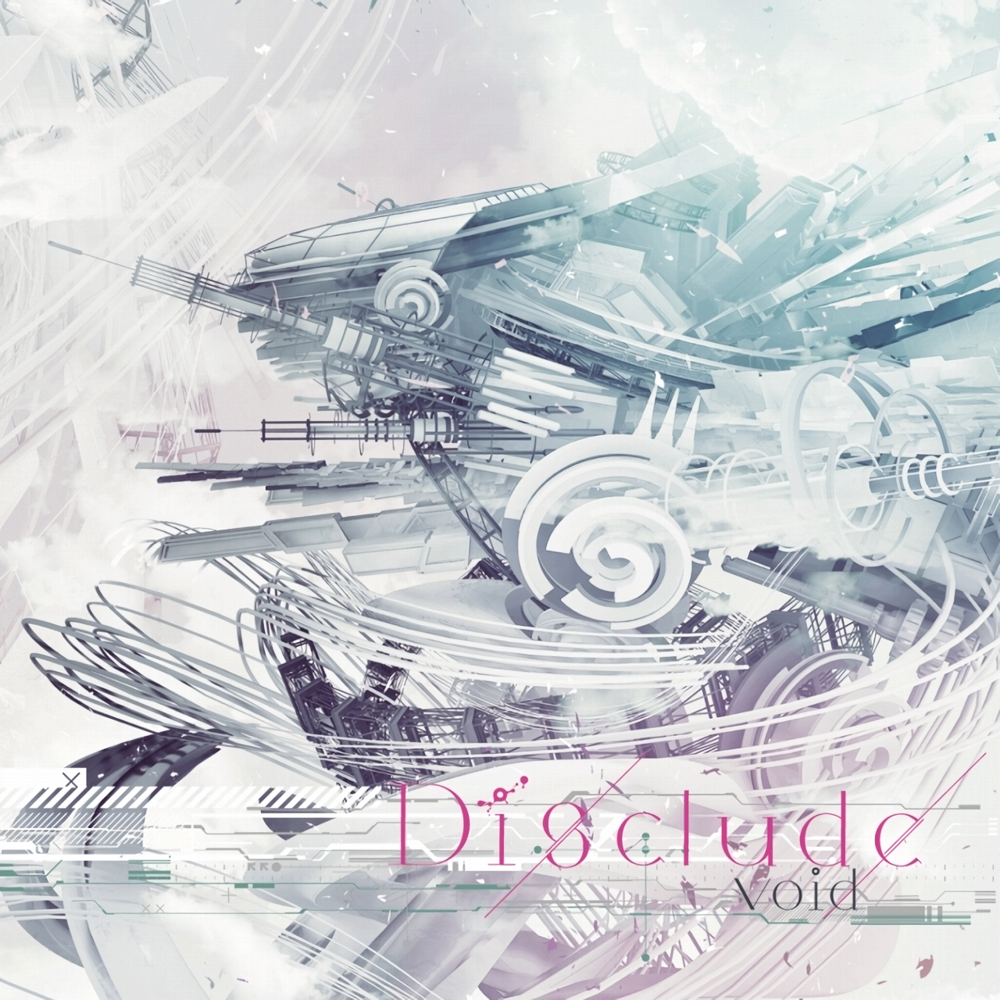
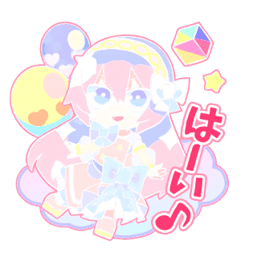

# [Remove White Background](https://github.com/LukaLanczos/Remove-White-Background)

## Options

 - White
   Remove white only.
 - Black
   Remove black only.
 - Grayscale
   Preserve colors and grayscale.

## Sample Images

### Original

### Remove White

### Remove Black

### Grayscale

## What is it used for?

It provides an intermediate step for image processing. This tool may make chroma subsampling and JPEG artifacts very noticeable. If you wish to remove them, please use the [Waifu2X](https://github.com/nihui/waifu2x-ncnn-vulkan) noise reduction function before processing your images on this website.
