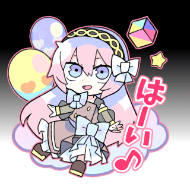

# Remove White Background
## Options

 - White
   Remove white only.
 - Black
   Remove black only.
 - Grayscale
   Preserve colors only.

## Sample Images

### Original

### Remove White

### Remove Black

### Preserve Colors Only

## What is it used for?

It provides an intermediate step for image processing. This tool may cause visible JPEG artifacts. To remove them, use the [Waifu2X](https://github.com/nihui/waifu2x-ncnn-vulkan) noise reduction function.
